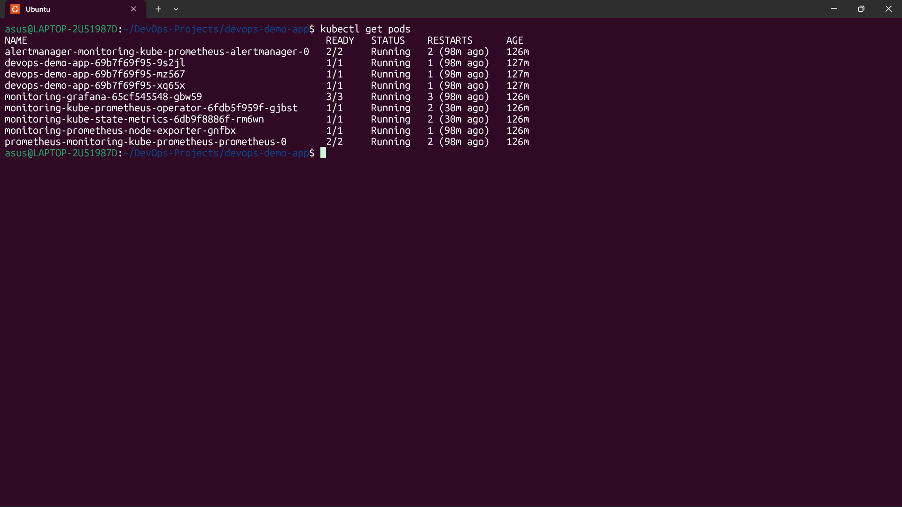
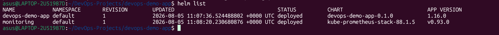
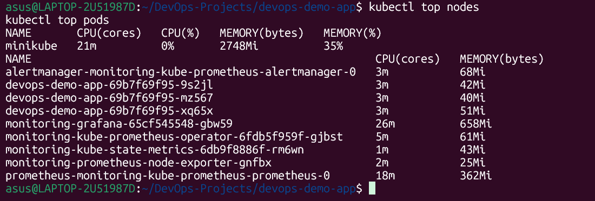
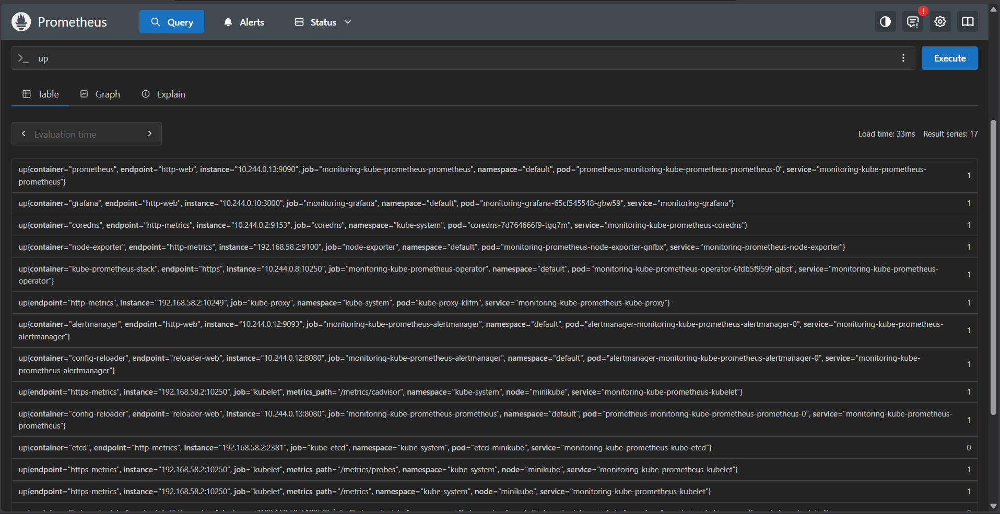
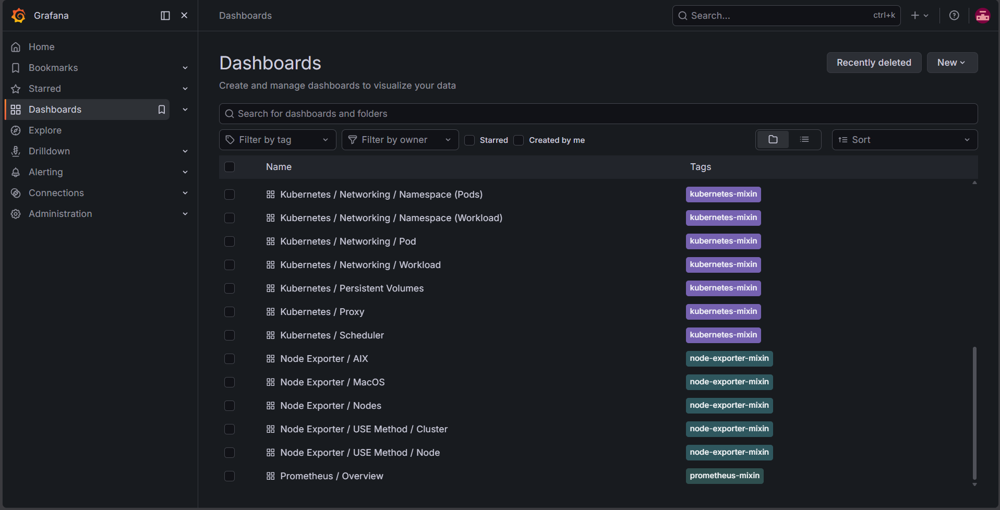

# 🚀 DevOps Demo App

A production-style DevOps project demonstrating containerization, Kubernetes orchestration, Helm packaging, and full-stack monitoring using Prometheus and Grafana.

---

# 📖 Project Overview

This project showcases a complete DevOps workflow for deploying a FastAPI application on Kubernetes.

The application is:

- Containerized using Docker
- Stored on Docker Hub
- Deployed on Kubernetes (Minikube)
- Managed using Helm Charts
- Configured using ConfigMaps
- Monitored using Prometheus
- Visualized using Grafana
- Resource monitored using Kubernetes Metrics Server

---

# 🏗 Architecture

```text
                 User
                   │
                   ▼
              Kubernetes Ingress
                   │
                   ▼
          Kubernetes Service
                   │
                   ▼
      FastAPI Deployment (3 Pods)
                   │
          ┌────────┴────────┐
          ▼                 ▼
      ConfigMap        Docker Image
                            │
                            ▼
                        Docker Hub


Prometheus ─────────► Collects Metrics

        │
        ▼

Grafana ────────────► Dashboards
```

---

# 🛠 Tech Stack

- FastAPI
- Docker
- Docker Hub
- Kubernetes
- Minikube
- Helm
- Prometheus
- Grafana
- Metrics Server
- Git
- GitHub
- Linux

---

# 📂 Project Structure

```text
devops-demo-app
│
├── helm/
├── deployment.yaml
├── service.yaml
├── ingress.yaml
├── configmap.yaml
├── Dockerfile
├── requirements.txt
├── app.py
├── images/
└── README.md
```

---

# ✨ Features

- Dockerized FastAPI application
- Kubernetes Deployment
- Kubernetes Service
- ConfigMap Integration
- Ingress Configuration
- Helm Chart Deployment
- Docker Hub Image Registry
- Prometheus Monitoring
- Grafana Dashboards
- Metrics Server Integration
- Scalable Kubernetes Pods

---

# 📸 Project Screenshots

## Kubernetes Deployment

All application and monitoring pods are running successfully.



---

## Helm Deployment

The application and monitoring stack are deployed and managed using Helm.



---

## Metrics Server

Real-time CPU and Memory utilization for the Kubernetes node and application pods.



---

## Prometheus Monitoring

Prometheus is successfully scraping Kubernetes and application metrics.

Query used:

```promql
up
```



---

## Grafana Dashboards

Grafana provides built-in dashboards for monitoring Kubernetes resources and workloads.



---

# 📚 What I Learned

Throughout this project I gained hands-on experience with:

- Building Docker images
- Managing Docker Hub repositories
- Kubernetes Deployments
- Kubernetes Services
- ConfigMaps
- Ingress
- Helm Charts
- Monitoring with Prometheus
- Dashboard creation with Grafana
- Kubernetes Metrics Server
- Troubleshooting Kubernetes deployments
- Container orchestration

---

# 🚀 Deployment

Clone the repository

```bash
git clone https://github.com/YOUR_USERNAME/devops-demo-app.git
```

Go to project

```bash
cd devops-demo-app
```

Deploy using Helm

```bash
helm upgrade --install devops-demo-app ./helm/devops-demo-app
```

Verify deployment

```bash
kubectl get pods
kubectl get svc
kubectl get ingress
```

---

# 📊 Monitoring

Install Prometheus & Grafana

```bash
helm install monitoring prometheus-community/kube-prometheus-stack
```

Useful commands

```bash
kubectl top nodes
kubectl top pods
```

---

# 👨‍💻 Author

**Om Suresh Ingle**

- GitHub: https://github.com/omsingle
- LinkedIn: https://www.linkedin.com/in/om-ingle-00403b417/

---

⭐ If you found this project useful, consider giving it a star.